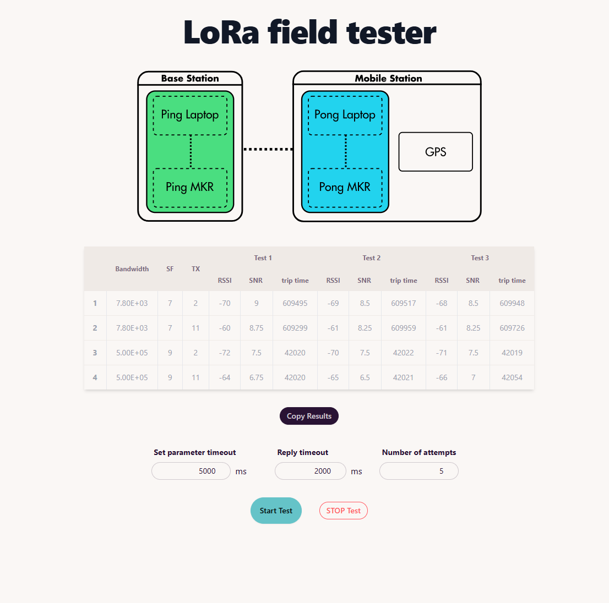

# LoRa field tester

This is an automatic range tester for the Arduino MKR WAN 1310. Developed as part of a University project for range testing a model Mars rover.

Two laptops with MKRs are connected to this site. A test is started and the webserver sets the parameters on each device and sends a packet back and forth. The test results are populated into the table.

Both the Arduinos run the same code!

I experimented with allowing a phone to join the site to contribute GPS data for the pong device.

Using:

- Tailwind + DaisyUI
- AlpineJS
- Simple Web Serial
- Socket IO



The user can paste anywhere on the screen with something like this:

```
7800 7 2
7800 7 11
7800 9 2
7800 9 11
```

To update the test data
